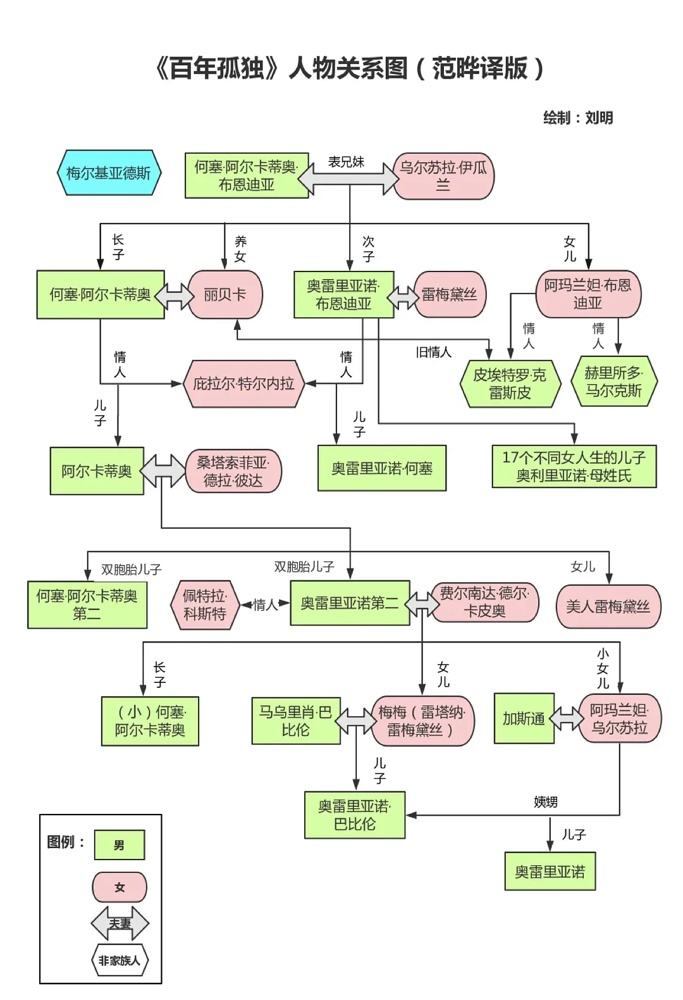

 # 百年孤独

本书作者为马尔克斯    
主要以一个家族在一百年内的七代人的故事，围绕着小镇马孔多的百年兴衰，反映了拉丁美洲一个世纪以来风云变幻的历史。

第一代何塞·阿尔卡蒂奥·布恩迪亚是一个传奇般的人物，带领村民跨越山川沼泽开辟新的家园。他也是一个非常与时俱进的人，从他屡屡从梅尔基亚德斯那里购买新鲜玩意就可以看的出来他对未来充满了向往，充满了求知欲。

家族的第一人被绑在树上，家族的最后一人被蚂蚁吃掉。

我知道自己才疏学浅为了这样一本书来写笔记确有班门弄斧之嫌，可是我真的对这本书的意义感到震撼，不写点什么记录下来气难平。

家族七代人，有的热衷于战争有的充满了求知欲有的手艺灵巧有的勇敢坚强有的光彩照人......然而最后整个百年家族随着狂风的来袭就这样消失无踪，百年的光辉与荣辱就这样烟消云散，就像从未存在过似的。不会再有人记得这片土地是在哪个家族的带领下开垦出来的，不会记得世间曾有这么一个家族。

在全书的最后，书店的主人那个智慧的老人悟透了人生的道理：“无论走到哪里，都应该记住，过去都是假的，回忆是一条没有尽头的路，一切以往的春天都不复存在，就连那最坚韧而又狂乱的爱情归根结底也不过是一种转瞬即逝的现实。”

## 名言摘抄

> 生命中曾经有过的所有灿烂，原来终究，都需要用寂寞来偿还。

> 生命从来不曾离开过孤独而独立存在。无论是我们出生、我们成长、我们相爱还是我们成功失败，直到最后的最后，孤独犹如影子一样存在于生命一隅。

> 生命中真正重要的不是你遭遇了什么，而是你记住了哪些事，又是如何铭记的。

> 我们趋行在人生这个亘古的旅途，在坎坷中奔跑，在挫折里涅盘，忧愁缠满全身，痛苦飘洒一地。我们累，却无从止歇；我们苦，却无法回避。

> 买下一张永久车票，登上一列永无终点的火车。

> 一个幸福晚年的秘决不是别的，而是与孤寂签订一个体面的协定。

> 所有人都显得很寂寞，用自己的方式想尽办法排遣寂寞，事实上仍是延续自己的寂寞。寂寞是造化对群居者的诅咒，孤独才是寂寞的唯一出口。

> 钟摆能让任何东西飞起来，却无法使自己腾空。

> 只有用水将心上的雾气淘洗干净，荣光才会照亮最初的梦想。

> 别错过机会，人生比你想象中的要短。

> 一分钟的和好抵得过一辈子的友谊。